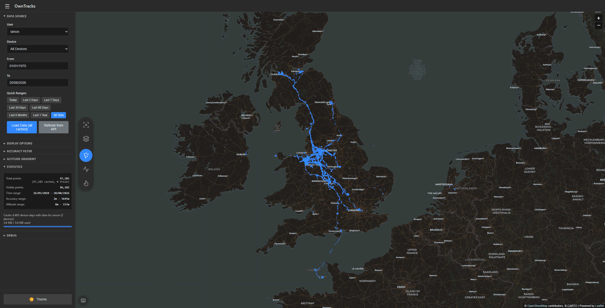
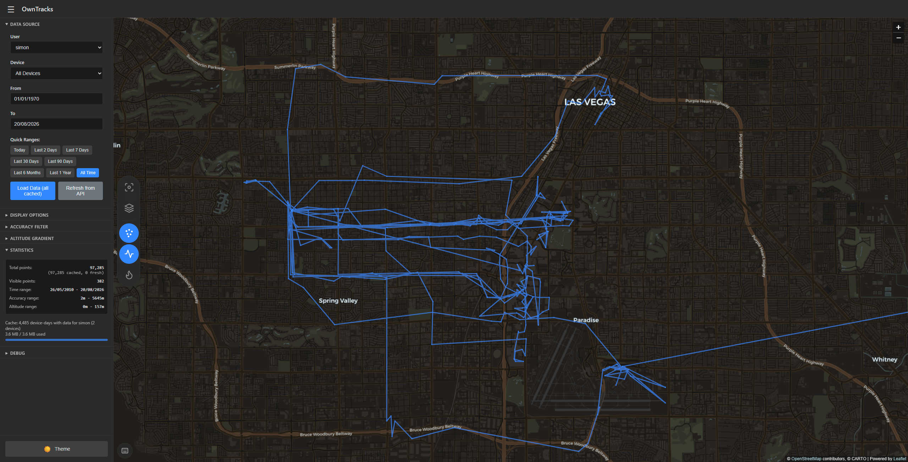
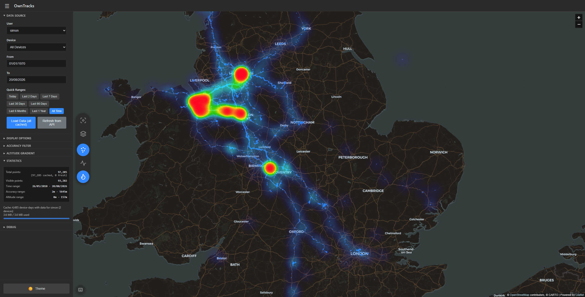
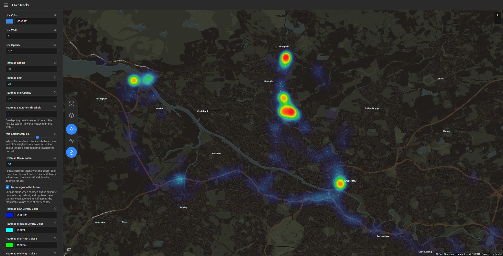
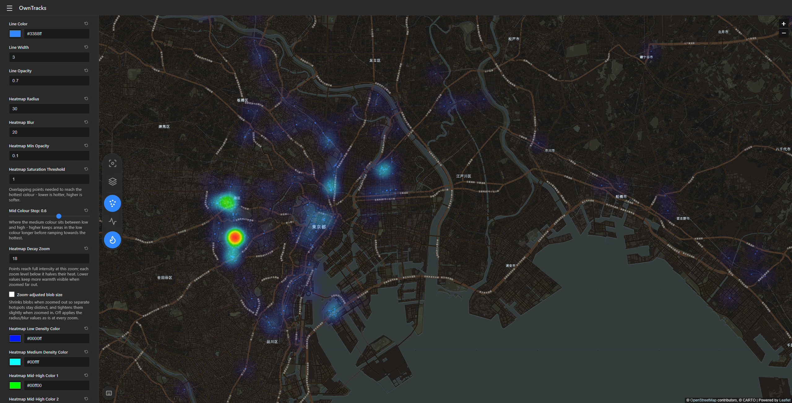
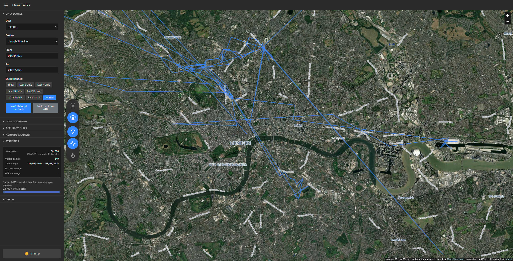

# OwnTracks Frontend

> **⚠️ AI-Generated Code Disclaimer**
>
> This code was generated with the assistance of AI tools. While it has been tested and should work as expected, please review and test it thoroughly before using it in production or with sensitive data. The authors accept no responsibility for any data loss or issues arising from its use.

A browser-based visualization tool for OwnTracks location data. Handles large datasets (100,000+ GPS points) efficiently through zoom-based sampling and client-side caching.

## Quick Start

### Option A: Docker (Recommended) ✅

```bash
docker run -d \
  -e APP_API_URL="https://owntracks.example.org" \
  -p 8080:80 \
  ghcr.io/tsumaru720/owntracks-frontend:latest
```

Or with Docker Compose:

```yaml
services:
  owntracks-frontend:
    image: ghcr.io/tsumaru720/owntracks-frontend:latest
    environment:
      APP_API_URL: https://owntracks.example.org
    ports:
      - "8080:80"
    restart: unless-stopped
```

**Note**: This method generates an `environment.json` file that will be placed in the document root. You can also provide a `config.json` file to override environment variables via bind mounts. See below detailed docker compose example if you wish to include config.json in your container. Note that config.json values will have priority over environment variables.

### Option B: Standalone (config.json)

1. Copy the configuration template:
   ```bash
   cp config.json.example config.json
   ```

2. Edit `config.json` and set your API URL:
   ```json
   {
     "api": {
       "url": "https://owntracks.example.org"
     }
   }
   ```

3. Serve the files with a suitable web server (e.g., nginx, Apache, Caddy, Python's `http.server`), then open `index.html` in a web browser.

**Note**: This option requires a web server because the application loads configuration files and makes API calls that may be restricted by browser security policies when opening `index.html` directly from the filesystem.

## Advisory

The OwnTracks recorder (the API) can take a long time to give a response if querying a lot of data. If you are proxying it via nginx for example, you may need to increase the proxy timeouts

```
    proxy_connect_timeout 10m;
    proxy_send_timeout    10m;
    proxy_read_timeout    10m;
    send_timeout          10m;
```

## Features

- **Smart Caching**: Display changes use cached data; no repeated API calls
- **Multiple Visualizations**: Points, route lines, altitude gradients, heatmap
- **Satellite View**: Toggle between street tiles and satellite imagery (with an optional road/place-name overlay) from the map dock
- **Data Persistence**: Optional IndexedDB caching across sessions
- **Dark/Light Mode**: Theme toggle with persistence
- **Configurable Filters**: GPS accuracy filter, date ranges, quick presets

## Usage

1. Select user and device from dropdowns
2. Pick a date range via the quick preset buttons, or set a custom From/To range
3. Click "Load Data"
4. Toggle points/lines/heatmap, switch street/satellite tiles, and recenter from the floating quick actions dock on the map
5. Customize styling in the sidebar (all changes use cached data)
6. Toggle dark/light mode at bottom of sidebar

### Keyboard Shortcuts

| Key | Action |
|-----|--------|
| `?` | Toggle the keyboard shortcuts help |
| `H` | Toggle heatmap |
| `P` | Toggle points |
| `L` | Toggle lines |
| `M` | Toggle satellite view |
| `F` | Fit map to data |

## Configuration

Configuration can be provided via:
1. **Docker** (recommended): environment variables (entrypoint.sh generates `environment.json`) or `config.json`
2. **Standalone**: Create `config.json` file
3. **Both**: `config.json` overrides environment variables

### Configuration Reference

**Note**: A lot of the settings here can be configured in the app's settings popout

SWS Environment variables are also supported - see [https://static-web-server.net](https://static-web-server.net/)

It is recommended to view this document directly as the table is too wide for the repo page - [See README.md](./README.md)

| Environment Variable | JSON Path | Description | Required | Default |
|---------------------|-----------|-------------|----------|---------|
| `APP_API_URL` | `api.url` | OwnTracks recorder API base URL | ✅ Yes | - |
| `APP_API_USERNAME` | `api.username` | Basic auth username | No | - |
| `APP_API_PASSWORD` | `api.password` | Basic auth password | No | - |
| `APP_API_COOKIENAME` | `api.cookieName` | Cookie name | No | - |
| `APP_API_COOKIEVALUE` | `api.cookieValue` | Cookie value | No | - |
| `APP_API_TIMEOUT` | `api.timeout` | Request timeout (milliseconds) | No | `600000` |
| `APP_MAP_TILESERVER` | `map.tileServer` | Map tile server URL template | No | `https://basemaps.cartocdn.com/rastertiles/voyager/{z}/{x}/{y}.png` |
| `APP_MAP_MINZOOM` | `map.minZoom` | Minimum zoom level | No | `2` |
| `APP_MAP_MAXZOOM` | `map.maxZoom` | Maximum zoom level | No | `21` |
| `APP_MAP_SATELLITEENABLED` | `map.satelliteEnabled` | Enable satellite tiles by default (layer toggle button) | No | `false` |
| `APP_MAP_SATELLITETILESERVER` | `map.satelliteTileServer` | Satellite tile server URL template | No | `https://server.arcgisonline.com/ArcGIS/rest/services/World_Imagery/MapServer/tile/{z}/{y}/{x}` |
| `APP_MAP_SATELLITELABELSERVER` | `map.satelliteLabelServer` | Road/place-name overlay for satellite view (empty string disables) | No | `https://basemaps.cartocdn.com/rastertiles/voyager_only_labels/{z}/{x}/{y}.png` |
| `APP_MAP_SATELLITEMAXZOOM` | `map.satelliteMaxZoom` | Max native zoom for satellite tiles (upscaled beyond) | No | `19` |
| `APP_DEFAULTS_USER` | `defaults.user` | Default username to select | No | - |
| `APP_DEFAULTS_DEVICE` | `defaults.device` | Default device to select | No | - |
| `APP_DISPLAY_POINTS_SHOW` | `display.points.show` | Show points by default | No | `true` |
| `APP_DISPLAY_POINTS_COLOR` | `display.points.color` | Default point color | No | `#3388ff` |
| `APP_DISPLAY_POINTS_SIZE` | `display.points.size` | Default point size | No | `2` |
| `APP_DISPLAY_POINTS_OPACITY` | `display.points.opacity` | Default point opacity | No | `0.5` |
| `APP_DISPLAY_POINTS_COLLAPSED` | `display.points.collapsed` | Point Configuration dropdown collapsed by default | No | `true` |
| `APP_DISPLAY_LINES_SHOW` | `display.lines.show` | Show lines by default | No | `true` |
| `APP_DISPLAY_LINES_COLOR` | `display.lines.color` | Default line color | No | `#3388ff` |
| `APP_DISPLAY_LINES_WIDTH` | `display.lines.width` | Default line width | No | `3` |
| `APP_DISPLAY_LINES_OPACITY` | `display.lines.opacity` | Default line opacity | No | `0.7` |
| `APP_DISPLAY_LINES_COLLAPSED` | `display.lines.collapsed` | Line Configuration dropdown collapsed by default | No | `true` |
| `APP_DISPLAY_ACCURACY_MAXMETERS` | `display.accuracy.maxMeters` | Max GPS accuracy filter (0 = all) | No | `0` |
| `APP_DISPLAY_PRECISION_LINKED` | `display.precision.linked` | Tie latitude/longitude to one precision range | No | `true` |
| `APP_DISPLAY_PRECISION_LATITUDERANGE` | `display.precision.latitudeRange` | Latitude precision range `[min, max]` decimal places (max `7` = 7+) | No | `[1, 7]` |
| `APP_DISPLAY_PRECISION_LONGITUDERANGE` | `display.precision.longitudeRange` | Longitude precision range `[min, max]` decimal places (max `7` = 7+) | No | `[1, 7]` |
| `APP_DISPLAY_ALTITUDE_MIN` | `display.altitude.min` | Min altitude for gradient | No | `0` |
| `APP_DISPLAY_ALTITUDE_MINMETERS` | `display.altitude.minMeters` | Minimum altitude filter (0 = all) | No | `0` |
| `APP_DISPLAY_ALTITUDE_MAX` | `display.altitude.max` | Max altitude for gradient | No | `1000` |
| `APP_DISPLAY_ALTITUDE_POINTS_ENABLED` | `display.altitude.points.enabled` | Enable altitude gradient on points | No | `false` |
| `APP_DISPLAY_ALTITUDE_POINTS_LOWCOLOR` | `display.altitude.points.lowColor` | Low altitude color (points) | No | `#00ff00` |
| `APP_DISPLAY_ALTITUDE_POINTS_HIGHCOLOR` | `display.altitude.points.highColor` | High altitude color (points) | No | `#ff0000` |
| `APP_DISPLAY_ALTITUDE_LINES_ENABLED` | `display.altitude.lines.enabled` | Enable altitude gradient on lines | No | `false` |
| `APP_DISPLAY_ALTITUDE_LINES_LOWCOLOR` | `display.altitude.lines.lowColor` | Low altitude color (lines) | No | `#00ff00` |
| `APP_DISPLAY_ALTITUDE_LINES_HIGHCOLOR` | `display.altitude.lines.highColor` | High altitude color (lines) | No | `#ff0000` |
| `APP_DISPLAY_HEATMAP_ENABLED` | `display.heatmap.enabled` | Enable heatmap by default | No | `false` |
| `APP_DISPLAY_HEATMAP_RADIUS` | `display.heatmap.radius` | Heatmap radius | No | `25` |
| `APP_DISPLAY_HEATMAP_BLUR` | `display.heatmap.blur` | Heatmap blur | No | `15` |
| `APP_DISPLAY_HEATMAP_MINOPACITY` | `display.heatmap.minOpacity` | Heatmap min opacity | No | `0.05` |
| `APP_DISPLAY_HEATMAP_MAX` | `display.heatmap.max` | Heatmap saturation threshold (points to hottest colour) | No | `20` |
| `APP_DISPLAY_HEATMAP_MAXZOOM` | `display.heatmap.maxZoom` | Max zoom for heatmap | No | `18` |
| `APP_DISPLAY_HEATMAP_ZOOMSCALING` | `display.heatmap.zoomScaling` | Zoom-adjusted blob size | No | `false` |
| `APP_DISPLAY_HEATMAP_COLLAPSED` | `display.heatmap.collapsed` | Heatmap Configuration dropdown collapsed by default | No | `true` |
| `APP_DISPLAY_HEATMAP_GRADIENT_MIDSTOP` | `display.heatmap.gradient.midStop` | Position of the medium color in the ramp (0.1-0.9) | No | `0.6` |
| `APP_DISPLAY_HEATMAP_GRADIENT_LOWCOLOR` | `display.heatmap.gradient.lowColor` | Heatmap low color | No | `#0000ff` |
| `APP_DISPLAY_HEATMAP_GRADIENT_MIDCOLOR` | `display.heatmap.gradient.midColor` | Heatmap mid color | No | `#00ffff` |
| `APP_DISPLAY_HEATMAP_GRADIENT_MIDHIGHCOLOR1` | `display.heatmap.gradient.midHighColor1` | Heatmap mid-high color 1 | No | `#00ff00` |
| `APP_DISPLAY_HEATMAP_GRADIENT_MIDHIGHCOLOR2` | `display.heatmap.gradient.midHighColor2` | Heatmap mid-high color 2 | No | `#ffff00` |
| `APP_DISPLAY_HEATMAP_GRADIENT_HIGHCOLOR` | `display.heatmap.gradient.highColor` | Heatmap high color | No | `#ff0000` |
| `APP_DISPLAY_STORAGEENABLED` | `display.storageEnabled` | Cache data in browser | No | `true` |
| `APP_DEBUG_CONSOLELOGGING` | `debug.consoleLogging` | Enable console logging | No | `false` |

### Authentication Rules

- **No auth**: Omit all auth settings
- **Basic auth**: Set both `username` and `password`
- **Cookie auth**: Set both `cookieName` and `cookieValue`
- **Both**: You can use basic auth AND cookie auth together

### Example config.json structure

```json
{
  "api": {
    "url": "https://recorder.example.org",
    "username": "user",
    "password": "pass"
  },
  "defaults": {
    "user": "john"
  },
  "debug": {
    "consoleLogging": false
  }
}
```

### Example Docker Compose

```yaml
services:
  owntracks-frontend:
    image: ghcr.io/tsumaru720/owntracks-frontend:latest
    environment:
      APP_API_URL: https://recorder.example.org
      APP_API_USERNAME: user
      APP_API_PASSWORD: pass
      APP_DEFAULTS_USER: john
      APP_DEBUG_CONSOLELOGGING: "false"
      SERVER_LOG_LEVEL: "info"
      SERVER_LOG_FORMAT: "pretty"
      SERVER_LOG_WITH_ANSI: "true"
    ports:
      - "8080:80"
    volumes:
      - ./config.json:/home/web/public/config.json:ro
    restart: unless-stopped
```

## Display Options

The point, line, and heatmap settings each live behind their own collapsible dropdown (Point/Line/Heatmap Configuration). Dropdown state is remembered between sessions and can be defaulted via `display.points.collapsed`, `display.lines.collapsed`, and `display.heatmap.collapsed` (`true` = collapsed).

### Quick Actions Dock
- Floating dock on the left edge of the map (slides along with the sidebar)
- Recenter map on loaded data
- Toggle points, route lines, and heatmap visibility
- Switch between street tiles and satellite imagery (hybrid view: imagery plus a road/place-name overlay; set `map.satelliteLabelServer` to an empty string for plain imagery)
- Toggle states are saved in browser settings; defaults can be set via `display.points.show`, `display.lines.show`, `display.heatmap.enabled`, and `map.satelliteEnabled`

### Points
- Customize color/size/opacity (visibility via the quick actions dock)
- Click a point for a detail popup (time, position, altitude, accuracy, battery)

### Lines
- Customize color/width/opacity (visibility via the quick actions dock)

### Altitude Gradient
- Color points or lines by altitude
- Independent settings for points vs lines
- The colour-scale range is a dual slider pinned to the loaded data's altitude range; it resets to the full span on each data load
- Configurable colors

### Heatmap
- Point density overlay (visibility via the quick actions dock)
- Customizable radius, blur, opacity
- Custom gradient colors (low/medium/high)

### Accuracy Filter
- Filter points by GPS accuracy (meters) - the device's own estimate of its fix error
- Filter points by minimum altitude (meters): only points recorded at or above the selected value survive; the slider's top stop is pinned to the loaded data's highest altitude
- 0 = show all points on the accuracy and altitude sliders; points that don't report the value are always kept
- The accuracy and altitude sliders use stepped scales (finer steps where values cluster) so small values are individually selectable; clicking the value number opens an editor for an exact value
- Loading new data resets the accuracy and altitude filters to 0 (persisted)
- Filter points by coordinate precision (decimal places of the stored lat/lon, e.g. 53.1 = 1, 53.4534562 = 7); the 7+ step includes anything with 7 or more, any other upper bound discards higher precision
- Coordinates with no decimals are always hidden; precision defaults to 1-7+, a lock ties latitude and longitude to one shared range, unlocking gives each axis its own slider

### Statistics
- Total/visible point counts, loaded time range, and accuracy and altitude ranges for the current selection
- Accuracy/altitude ranges span every loaded point of the selection (points that don't report the value are ignored); the min rounds down and the max rounds up
- The total count shows a cached/fresh breakdown beneath it when the load used both the cache and the API
- Cache status shown when browser storage caching is enabled: days with cached data for the selection plus storage usage (see Data Caching)

### Debug Options
- **Console Logging**: Toggle console output
- **Cache location data in browser**: Enable the persistent browser cache (see Data Caching below)
- **Clear Device Cache**: Remove cached data for the selected user/device only
- **Clear All Cache**: Remove all cached location data (all users/devices); settings and theme are kept
- **Clear Settings**: Reset all saved settings (display, theme, selections); cached data is kept
- **Clear All Data**: Remove everything - cached data, settings, and theme

## Data Caching

1. **Memory Cache** (automatic): API responses stored in memory; display changes trigger instant redraws
2. **Storage Cache** (optional): Enable "Cache location data in browser" (Debug section) to persist across sessions in IndexedDB; data cached per day per device

Storage cache behaviour:
- On page load, a selection with cached days inside the current date range renders straight from the cache with no API traffic; uncached days and the current day fill in on the next Load Data or Refresh from API
- The current day is never cached - it is always fetched fresh while inside the selected range, and cached complete from the following day
- Days that return no data are cached as empty, so completed ranges are not re-fetched
- The Load Data button and cache status cover "All Devices"/"All Users" selections too, counting device-days when multiple devices are selected

## Performance

- Canvas rendering with dedicated canvases for points and lines, so updating one layer never re-renders the other
- Point markers are culled to the viewport when zoomed in (zoomed-out views draw the full set)
- Route lines are sliced to the padded viewport and decimated with a sub-pixel tolerance (capped at 10k vertices per render via an adaptive tolerance), then re-sliced after zooms and large pans - so Leaflet's per-vertex line pipeline only ever sees the visible portion of the track; altitude-gradient lines are batched into one multi-part polyline per colour
- Zoom-triggered line/heatmap redraws run debounced after the zoom settles
- Cached loads read all requested days in a single IndexedDB range query instead of one read per day; storage-usage totals are walked once and memoized until the cache changes
- Uses `L.circleMarker` for efficient rendering
- Auto-fits map bounds when data loads

## Examples

### Points


### Route Lines


### Heatmap


### Heatmap Tuning for closer zooms

This illustrates how you can tweak the heatmap settings to alter data visualization




### Satellite View



## Browser Compatibility

Requires ES6, localStorage, Fetch API, CSS Grid/Flexbox. Tested on Chrome, Firefox, Safari, Edge.

## Credits

- [Leaflet.js](https://leafletjs.com/) - Map rendering
- [CARTO](https://carto.com/) - Map tiles
- [Esri](https://www.esri.com/), Maxar, Earthstar Geographics - Satellite imagery (satellite view)
- [Leaflet.heat](https://github.com/Leaflet/Leaflet.heat) - Heatmap
- [OwnTracks](https://owntracks.org/) - Location tracking platform
- [static-web-server](https://github.com/static-web-server/static-web-server) - Static Web Server
